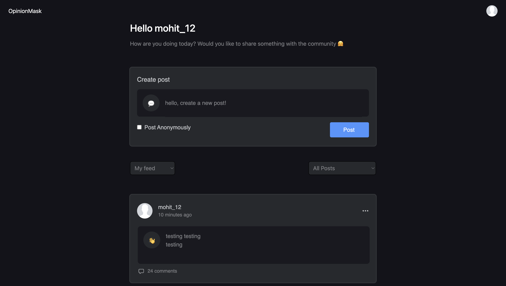

# OpinionMask



## Table of Contents

- [OpinionMask](#opinionmask)
  - [Table of Contents](#table-of-contents)
  - [Requirements:](#requirements)
  - [Tech Stack](#tech-stack)
    - [Backend:](#backend)
    - [Frontend](#frontend)
  - [Getting Started](#getting-started)
    - [Backend](#backend-1)
    - [Frontend](#frontend-1)
    - [Running Unit tests:](#running-unit-tests)
    - [API Endpoints:](#api-endpoints)
    - [Database Design:](#database-design)
      - [Post Table](#post-table)
  - [Security:](#security)


## Requirements:
1. User Register/Login/logout
2. User able to Post anonymously or non-anonymously.
3. User should be able to Delete their own post of both the above mentioned types. (API only).
4. User should be able to list all the posts.
5. User should be able to view a news feed of all the posts.


## Tech Stack
### Backend:

- Django Rest Framework (DRF)
- SQLite

### Frontend
- React
- TailwindCSS


## Getting Started

### Backend 
Note: I am using `Python 3.11.4`

1. Setup a virtual environment:
   ```
   python3 -m venv venv
   source venv/bin/activate
   ```
2. Install the required packages:
   ```
   pip install -r requirements.txt
   ```
3. Run migrations:
   ```
   python manage.py migrate
   ```
4. Start the server:
   ```
   python manage.py runserver
   ```

### Frontend

1. Navigate to the `frontend` directory.
2. Install the required packages:
   ```
   npm install
   ```
3. Start the development server:
   ```
   npm start
   ```
4. Application should be up at: http://localhost:3000/


### Running Unit tests:
Running Unit tests:
```
python manage.py test posts
```

### API Endpoints:

| Method | Endpoint                          | Description                      | Parameters (Query)                                    |
|--------|-----------------------------------|----------------------------------|--------------------------------------------------------|
| POST   | `/api/users/register/`            | Register a new user.             | `username`, `password`, `email`                        |
| POST   | `/api/users/login/`               | Log in an existing user.         | `username`, `password`                                |
| POST   | `/api/users/logout/`              | Log out the authenticated user.  |                                                        |
| GET    | `/api/users/isAuthenticated/`    | Check if the user is authenticated. |                                                 |
| GET    | `/api/users/profile/`             | Get the user's profile.           |                                                        |
| GET    | `/api/posts/`                     | Get filtered posts.               | `ordering` (optional), `my_post` (optional), `anon_filter` (optional) |
| POST   | `/api/posts/`                     | Create a new post.                | `content` (optional), `is_anon` (optional)             |
| GET    | `/api/posts/{post_id}/`           | Get details of a specific post.   |                                                        |
| DELETE | `/api/posts/{post_id}/`           | Delete a specific post.           |                                                        |

### Database Design:

#### Post Table

| Column Name | Data Type       | Description                           | 
|-------------|-----------------|---------------------------------------|
| content     | TextField       | Content of the post.        |                                        
| is_anon     | BooleanField    | Indicates if the post is anonymous.   |                                        
| created_at  | DateTimeField   | Timestamp for post creation.          |                                        
| updated_at  | DateTimeField   | Timestamp for last update.            |                                        
| created_by  | ForeignKey(User)| Reference to the user who created the post. |        


## Security:
Implement basic security measures to protect the application from common vulnerabilities.
1. Rate limit for backend
2. auth token are saved on header (http-only) not on localstorage.
